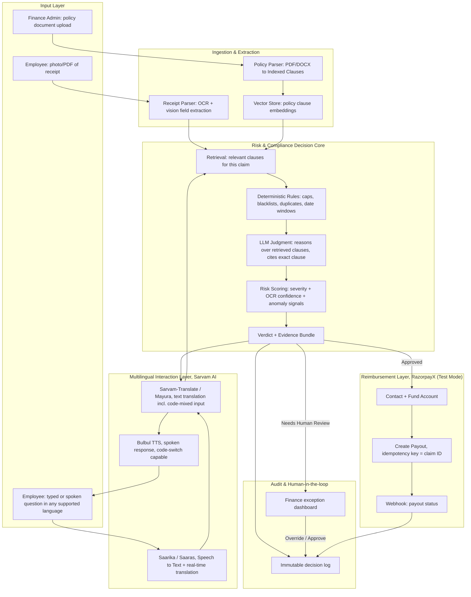

# Sahi Kharch

Risk-aware, multilingual expense policy checker. A Razorpay AI Buildathon project.

Sahi Kharch is an agent that sits between a company expense policy and an employee
claim. It gives a verdict backed by the exact policy clause, explains that
verdict in the employee's own language (typed or spoken, including natural
code-mixing like Hinglish), and can actually trigger the reimbursement payout
once a claim is approved, closing the loop end to end.

## The Problem

Most mid-to-large Indian companies run expense reimbursement the same way: an
employee submits a receipt, and someone in finance manually checks it against a
20 to 60 page policy PDF, usually written only in English. Three things go
wrong at scale:

1. **Inconsistency.** Two reviewers interpret an ambiguous clause differently;
   the same claim gets approved for one employee and rejected for another.
2. **No real audit trail.** A status is stamped with no record of which clause
   justified it, which becomes a problem the moment an auditor asks "why".
3. **Language exclusion.** A large share of claim-submitting staff (field
   sales, plant and warehouse workers, regional offices) is more comfortable
   asking "Ye claim allowed hai kya?" in Hindi, Marathi, Telugu, or Kannada
   than reading an English policy clause.

## What It Covers

**In scope:**

- Ingest one or more versioned company expense policy documents.
- Ingest a receipt (image or PDF) and extract structured claim data.
- Produce a verdict: Approved / Flagged / Rejected / Needs Human Review,
  backed by exact clause text, clause ID, and page number.
- A composite risk score, not just a binary decision.
- Multilingual interaction (English, Hindi, Marathi, Telugu, Kannada, and more)
  via Sarvam AI, including code-mixed queries.
- A finance/admin exception queue for anything the system cannot confidently
  resolve.
- A light RazorpayX Payouts integration (mock mode by default) that simulates
  disbursing an approved reimbursement, demonstrating a closed loop from receipt
  upload to processed payout — no real money moves.

## High-Level Architecture



There is exactly one decision core. The multilingual layer is a translation
shell wrapped around it, not five separate reasoning pipelines. A claim
reasoned about in Hindi and the identical claim in Telugu must produce the same
verdict and the same cited clause. One canonical decision, many front doors.

## Component Breakdown

### Policy Ingestion

Accepts a PDF/DOCX policy and parses it into clause-level chunks, each tagged
with a clause ID, section heading, page number, and effective-from date (for
policy versioning). Chunks are embedded into a vector index for retrieval and
kept in a structured table for exact-text lookup. Exact clause text shown to
the user always comes from the structured store, never a paraphrase, to avoid
drift from the source.

### Receipt Ingestion

Extracts vendor name, date, amount, currency, tax/GST breakup, and an inferred
category (travel, meals, client entertainment, etc.) via vision-based document
extraction. Runs quality checks (legibility, GSTIN presence when required, date
within claim window) flagged as extraction-confidence issues, distinct from
policy-violation issues.

### Risk & Compliance Decision Core

Runs in two stages rather than asking an LLM to "just decide":

1. **Deterministic rules first.** Unambiguous numeric thresholds (hotel cap,
   per-diem limit, blacklisted category, duplicate receipt hash, filing
   deadline) are checked with plain code. An LLM should never be the thing
   enforcing "2,000 rupees per day", because it can be talked out of a hard
   number.
2. **LLM reasoning for ambiguous cases.** Vaguer policy language (reasonable
   client entertainment, appropriate for grade) is reasoned over by the LLM,
   given only the retrieved clause text plus claim data, and required to ground
   its explanation in that text.
3. **Risk scoring.** Every claim gets a composite score combining violation
   severity, extraction confidence, and anomaly signals (duplicate submission,
   round amounts, invoice splitting, vendor spikes). The score routes a claim
   to auto-approve, auto-flag, or the human exception queue.

### Audit & Human-in-the-Loop

Every verdict, cited clause, risk score component, and human override is
written to an append-only log: a permanent, inspectable record of why the
decision was made. A finance/admin dashboard surfaces only the claims needing
attention, each with its evidence bundle pre-assembled.

### Reimbursement Layer (RazorpayX Payouts, Mock Mode)

See Section 7 for the full walkthrough.

## The Multilingual Layer and Sarvam AI

Sarvam's models are trained specifically on Indian language data, including
natural code-switching, so mixed-script, mixed-language input is handled
natively.

- **Voice input (Saaras / Saarika):** real-time speech-to-text with translation,
  so queries reach the decision core as clean text.
- **Text translation (Sarvam-Translate / Mayura):** typed queries in any
  supported language, formal or code-mixed, are normalized before retrieval and
  reasoning; output is translated back for the response.
- **Voice output (Bulbul TTS):** explanations read back in natural
  code-switched speech for staff who prefer hearing an answer.
- **Document/OCR assist (Sarvam Parse):** a second option for receipts and
  policy documents in a regional language.

## The RazorpayX Integration (Mock by Default, Real When Configured)

The buildathon framing rewards showing a closed loop with a real audit trail, so
Sahi Kharch wires the full payout flow end to end — Contact, Fund Account,
payout, and webhook. Because RazorpayX requires business KYC (PAN/GST) even for
test-mode keys, the demo runs with `RAZORPAY_MOCK=1`: every API call is
short-circuited with fake IDs and a "queued" state, so the loop and its audit
trail work with no real credentials. Flip the flag off, drop in real keys, and
the same code moves real money.

1. **Contact:** each employee is one RazorpayX Contact, created on first use.
2. **Fund Account:** the employee's bank account or UPI VPA linked to that
   Contact (test mode can be seeded with dummy data).
3. **Payout:** created on approval for the claimed amount. The claim ID is both
   the payout reference and the idempotency key, so a retry or a UI double-click
   can never trigger a duplicate reimbursement.
4. **Webhook:** RazorpayX sends lifecycle updates (queued, processing,
   processed, reversed, failed); Sahi Kharch updates the claim's audit trail, so
   the record reads "Approved to Payout `pout_XXXX` to Processed on [date]". In
   mock mode the "Simulate processing" admin button replays this step.

Scoped as "light" because the demo default is a mock — the audit trail is real,
the money isn't. With real keys, test mode uses a dummy balance and payouts must
be advanced manually from the dashboard, which is exactly right for a controlled
demo.

## Real-World Scenarios

- **Field sales executive, Nagpur.** Uploads fuel and hotel receipts as photos,
  asks in Marathi whether the hotel charge clears the per-night cap. Gets an
  instant verdict with the exact clause, and sees the simulated reimbursement
  move to processing if approved.
- **Finance team, 500-person company, month-end.** Runs ~300 claims through the
  system and reviews only the small fraction the risk engine could not
  confidently resolve, each with evidence assembled.
- **New employee.** Types a Hindi question about a dinner bill and gets a clear
  answer with the specific meal-allowance clause.
- **Compliance review, six months later.** An auditor sees the exact cited
  clause, risk score components, and mock payout ID in the immutable log in
  seconds.

## Product Specifics

**Positioning:** a risk-aware, multilingual expense-compliance co-pilot for
Indian finance teams and their distributed, non-English-first workforce.

**Primary users:** employees (claim submitters), finance/AP reviewers, and
compliance/audit.

**Key differentiators:**

1. Clause-level citation on every verdict: explainability and audit trail are
   the product.
2. Genuine Indian-language support including natural code-mixing, not a
   translated English UI.
3. A closed reimbursement loop demonstrated against RazorpayX mock APIs (or
   test-mode with real keys), with a full audit trail.
4. Risk scoring instead of a binary gate, surfacing how risky and why.

**Metrics to report:**

- Precision/recall (or an approve/flag/reject confusion matrix) against the
  synthetic claim set, including the false-positive cost.
- Percent of claims auto-resolved vs. sent to human review, with an honest list
  of what the system could not resolve and why.
- Consistency check: the same claim asked in two languages returns the same
  verdict and cited clause.
- Average end-to-end latency per claim (receipt upload to verdict).

## Suggested Tech Stack (What, Not Code)

| Layer                             | Role                                                                                                                                                          |
| --------------------------------- | ------------------------------------------------------------------------------------------------------------------------------------------------------------- |
| Orchestration backend             | Coordinates ingestion, retrieval, rules, LLM judgment, risk score, response/payout.                                                                           |
| Vector store                      | Holds embedded policy clauses for retrieval.                                                                                                                  |
| Structured claims database        | Stores claims, extracted receipt fields, verdicts, risk scores, and the append-only audit log.                                                                |
| LLM (reasoning core)              | Clause-grounded judgment on ambiguous cases and plain-language explanations.                                                                                  |
| Sarvam AI APIs                    | Saarika/Saaras (speech-to-text + translate), Sarvam-Translate/Mayura (text translation), Bulbul (text-to-speech), optionally Sarvam Parse for vernacular OCR. |
| Vision/OCR                        | Extracts vendor, amount, date, tax from receipt images/PDFs.                                                                                                  |
| RazorpayX Payouts API (test mode) | Contact to Fund Account to Payout to Webhook for the closed-loop demo.                                                                                        |
| Frontend                          | Employee-facing chat/voice interface, plus a finance/admin dashboard.                                                                                         |

## This Repo

A monorepo-style single repo with two parts:

- **Frontend** (`src/`): a React + Vite app with Tailwind CSS. Employee-facing
  claim/ask flow plus the finance/admin dashboard. See `src/` for components
  and `public/` for static assets.
- **Backend** (`backend/`): a small Express server that wraps Sarvam AI
  (STT/TTS/translate), receipt PDF/image parsing, and the LLM + embedding calls.
  See `backend/src/routes/` for the HTTP API and `backend/src/lib/` for the
  service clients. The frontend calls it through `src/lib/api.js`.

## Local Development

```bash
# Backend (Sarvam AI, receipt parsing, LLM/embedding proxies)
cd backend
npm install
npm run dev        # Express server on http://localhost:4000

# Frontend (in the repo root)
npm install
cp .env.example .env   # set Firebase + VITE_API_BASE_URL values
npm run dev            # start the Vite dev server
npm run build          # production build
npm run lint           # lint with ESLint
```

## Honest Final Thoughts

We want to be straight with you about what's real, what's simulated, and where
this goes next — because the parts that matter for a compliance product are the
parts we built for real.

**The payout loop is mocked at the money boundary, not faked.** RazorpayX
requires business KYC (PAN/GST) to issue even test-mode keys — reasonable for a
payment processor, a non-starter for a buildathon repo. So we wired the
_entire_ loop for real — Contact creation, Fund Account linking, idempotent
payouts keyed on the claim ID, and an HMAC-verified webhook that writes
`payout_status` back into the immutable audit trail — then pointed the
outermost call at a mock when `RAZORPAY_MOCK=1`. Flip the flag off, drop in
real keys, and the same code moves real money. We'd rather show an honest mock
than a screenshot of a dashboard we can't reproduce live.

**A few other deliberate trade-offs, and what changes in production:**

- **Firestore writes happen client-side, gated by security rules.** Perfect for
  a demo with a handful of trusted users; in production every write would route
  through the backend with `firebase-admin` (the way the payout routes already
  do), so rules become defense-in-depth rather than the only gate.
- **Clause retrieval is a brute-force cosine scan.** Fine for a 30–60 page
  policy (a few hundred clauses); at thousands we'd swap in a real vector index
  (pgvector, Pinecone, or Vertex Vector Search) — the `retrieveClauses`
  interface wouldn't change.
- **Batch runs are a client-side sequential LLM loop.** Great for a demo of ~20
  claims; in production this is a durable job queue (Cloud Tasks / BullMQ) with
  retries and per-claim isolation, so one slow receipt can't stall a batch.
- **The consistency check re-runs the LLM independently per language** and
  compares verdict + cited clauses — the real Section 8 metric, not a
  translation round-trip. In production we'd cache the deterministic context
  (rules + retrieval) across languages to cut cost.
- **No rate limiting; compute routes are unauthenticated.** Fine behind a
  trusted frontend; production adds Firebase token verification on every route
  (the payout route already does this) and per-tenant quotas.

**If we shipped this for real, the order would be:** real RazorpayX keys + a
production webhook URL → move all Firestore writes server-side → vector index
→ job queue for batches → per-route auth + rate limits → secret management (not
`.env`) → observability (traces on every verdict so an auditor can replay a
decision). None of that is research — it's a week of wiring, and the
architecture is already shaped for it.

The bet we're making: **explainability, multilingual access, and a real audit
trail are the hard part of expense compliance — the payout is plumbing.** We
built the hard part for real, and were honest about the plumbing.
